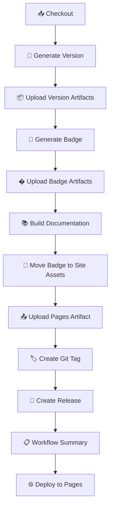

# 🚀 GitHub Actions Collection

[](https://github.com/framinosona/Github_Actions/actions/workflows/ci.yml)
[](https://framinosona.github.io/Github_Actions/)
[](LICENSE.md)

A comprehensive collection of reusable GitHub Actions for .NET development, documentation generation, versioning, and CI/CD automation.

## ✨ Features

- 🔢 **Smart Versioning** - Semantic version calculation based on Git tags
- 🏷️ **Dynamic Tagging** - Automated Git tag creation and management
- 🎨 **Badge Generation** - Custom SVG badges with shields.io integration
- 🚀 **Release Automation** - GitHub release creation with assets
- 📚 **Documentation** - DocFX-powered static site generation
- 🌐 **GitHub Pages** - Automated documentation deployment
- 🛠️ **Tool Management** - .NET global tool installation and management
- 📦 **Package Publishing** - NuGet package upload and feed management
- 🔐 **Security** - Apple certificate installation for code signing

## 📋 Available Actions

### Core Actions

| Action | Description | Key Features |
|--------|-------------|--------------|
| [🔢 generate-version](./generate-version/) | Smart semantic versioning | Git tag analysis, branch-aware versioning, multiple output formats |
| [🏷️ git-tag](./git-tag/) | Git tag management | Annotated/lightweight tags, force options, validation |
| [🎨 generate-badge](./generate-badge/) | Custom badge creation | SVG generation, shields.io integration, multiple formats |
| [🚀 github-release](./github-release/) | Release automation | Auto-generated notes, asset uploads, draft/prerelease support |

### .NET Ecosystem

| Action | Description | Key Features |
|--------|-------------|--------------|
| [🛠️ dotnet-tool-install](./dotnet-tool-install/) | .NET tool management | Global tool installation, version control, caching |
| [📚 dotnet-docfx-build](./dotnet-docfx-build/) | Documentation generation | DocFX integration, theme support, metadata injection |
| [📄 dotnet-docfx-metadata](./dotnet-docfx-metadata/) | API documentation | Metadata extraction, XML documentation |
| [📖 dotnet-docfx-pdf](./dotnet-docfx-pdf/) | PDF generation | Documentation export to PDF |
| [📦 dotnet-nuget-upload](./dotnet-nuget-upload/) | Package publishing | NuGet upload, feed management |
| [🔧 dotnet-nuget-feed-setup](./dotnet-nuget-feed-setup/) | Feed configuration | Private feed setup, authentication |
| [🔍 dotnet-cyclonedx](./dotnet-cyclonedx/) | SBOM generation | Software Bill of Materials creation |

### Specialized Actions

| Action | Description | Key Features |
|--------|-------------|--------------|
| [🔐 install-apple-certificate](./install-apple-certificate/) | Code signing setup | Apple certificate installation, keychain management |
| [🎯 dotnet](./dotnet/) | .NET SDK actions | Multi-framework support, build automation |

## 🏗️ CI/CD Pipeline

This repository includes a comprehensive CI/CD pipeline (`.github/workflows/ci.yml`) that demonstrates the integration of multiple actions:



### Pipeline Features

- **🔄 Automatic Versioning**: Semantic version calculation with Git tag analysis
- **📦 Artifact Management**: Version files and badges uploaded as workflow artifacts
- **🎨 Badge Generation**: SVG badges with automated integration into documentation
- **🏷️ Smart Tagging**: Conditional tag creation based on branch rules and force-release option
- **🚀 Release Management**: Automated GitHub releases with generated notes
- **📚 Documentation**: DocFX-powered site generation with integrated assets
- **🌐 Two-Stage Deployment**: Separate build and deploy jobs for GitHub Pages
- **📋 Rich Summaries**: Detailed workflow summaries with status and quick links

### Workflow Structure

The CI/CD pipeline consists of two main jobs:

#### 🏗️ Build and Release Job

- **Version Generation**: Creates semantic versions with multiple output formats
- **Artifact Upload**: Stores version files and badges for download
- **Documentation Build**: Generates DocFX-powered documentation site
- **Asset Integration**: Automatically includes badges in documentation
- **Conditional Release**: Creates tags and releases only on main branch or force-release
- **Summary Generation**: Provides detailed workflow execution summary

#### 🌐 Deploy to Pages Job

- **GitHub Pages Deployment**: Deploys documentation site to GitHub Pages
- **Asset Verification**: Ensures badges and documentation are properly deployed
- **Deployment Summary**: Provides links and verification of deployed resources

### Workflow Triggers

- **Push Events**: Automatically runs on `main` and `develop` branches
- **Pull Requests**: Validates changes targeting the `main` branch
- **Manual Dispatch**: Supports manual execution with version and release options

## 🚀 Quick Start

### Basic Usage

```yaml
name: Example Workflow
on: [push]

jobs:
  build:
    runs-on: ubuntu-latest
    steps:
      - uses: actions/checkout@v4

      - name: Generate Version
        id: version
        uses: framinosona/Github_Actions/generate-version@main
        with:
          major: '1'
          minor: '0'

      - name: Create Release
        uses: framinosona/Github_Actions/github-release@main
        with:
          tag: ${{ steps.version.outputs.VERSION_FULL }}
          title: 'Release ${{ steps.version.outputs.VERSION_FULL }}'
          generate-notes: 'true'
```

### Advanced Integration

```yaml
name: Full CI/CD Pipeline
on:
  push:
    branches: [ main ]

jobs:
  release:
    runs-on: ubuntu-latest
    steps:
      - uses: actions/checkout@v4
        with:
          fetch-depth: 0

      - name: Generate Version
        id: version
        uses: framinosona/Github_Actions/generate-version@main
        with:
          major: '2'
          minor: '1'
          output-txt: 'version.txt'

      - name: Create Git Tag
        uses: framinosona/Github_Actions/git-tag@main
        with:
          tag: ${{ steps.version.outputs.VERSION_FULL }}
          message: 'Release ${{ steps.version.outputs.VERSION_FULL }}'

      - name: Generate Badge
        uses: framinosona/Github_Actions/generate-badge@main
        with:
          label: 'version'
          message: ${{ steps.version.outputs.VERSION_FULL }}
          output-file: 'badge.svg'
          output-format: 'svg'

      - name: Build Documentation
        uses: framinosona/Github_Actions/dotnet-docfx-build@main
        with:
          metadata: '{"_appTitle":"My Project"}'

      - name: Create Release
        uses: framinosona/Github_Actions/github-release@main
        with:
          tag: ${{ steps.version.outputs.VERSION_FULL }}
          assets: |
            version.txt
            badge.svg
            _site/**/*
```

## 📚 Documentation

Complete documentation is available at: **[https://framinosona.github.io/Github_Actions/](https://framinosona.github.io/Github_Actions/)**

### Action Documentation

Each action includes comprehensive documentation:

- 📖 **README.md** - Detailed usage instructions
- 🔧 **action.yml** - Input/output specifications
- 💡 **Examples** - Real-world usage scenarios
- 🛠️ **Troubleshooting** - Common issues and solutions

## 🏗️ Architecture Principles

All actions follow consistent design patterns:

### 📋 Three-Step Structure

1. **✅ Validation** - Comprehensive input validation
2. **⚙️ Execution** - Main functionality with error handling
3. **📊 Summary** - Detailed output summaries

### 🎯 Standards

- **🔍 Input Validation** - All inputs validated upfront
- **📤 Rich Outputs** - Multiple output formats for flexibility
- **🛡️ Error Handling** - Graceful failure with actionable messages
- **📊 Summaries** - Optional detailed execution summaries
- **🎨 Consistent Styling** - Emoji-based naming and clear descriptions

## 🤝 Contributing

1. **Fork** the repository
2. **Create** a feature branch: `git checkout -b feature/amazing-action`
3. **Follow** the [action structure principles](.github/copilot-instructions.md)
4. **Test** your action thoroughly
5. **Submit** a pull request

### Development Guidelines

- Follow the established three-step pattern
- Include comprehensive input validation
- Provide detailed documentation
- Add usage examples
- Ensure cross-platform compatibility

## 📄 License

This project is licensed under the MIT License - see the [LICENSE.md](LICENSE.md) file for details.

## 🙏 Acknowledgments

- GitHub Actions team for the excellent platform
- DocFX team for documentation tooling
- shields.io for badge generation services
- The open-source community for inspiration and feedback

---

<div align="center">

**⭐ Star this repository if you find it useful!**

[📚 Documentation](https://framinosona.github.io/Github_Actions/) • [🐛 Report Bug](https://github.com/framinosona/Github_Actions/issues) • [💡 Request Feature](https://github.com/framinosona/Github_Actions/issues)

</div>
